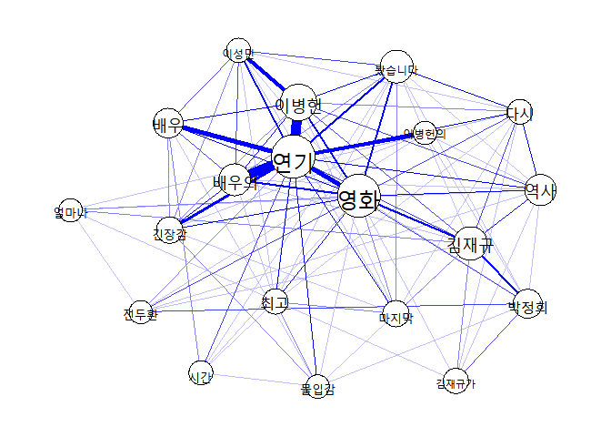

Text Network Graph by qgraph package
================

웹 데이터를 활용한 **텍스트 네트워크** 그래프 그리기
====================================================

이번 글에서는 [R을 활용하여 웹데이터 수집하기](https://refree.github.io/Web_Scraping/) 를 통해 수집한 데이터를 활용하여, 텍스트 네크워크 그래프를 그려보도록 하겠습니다.

제가 [2017년](https://www.dbpia.co.kr/journal/articleDetail?nodeId=NODE07231534#)과 [2018년](https://www.dbpia.co.kr/journal/articleDetail?nodeId=NODE07408574) 작성한 논문에서도 이와 같은 부분을 활용하여, 제 도메인 필드에서 핵심이 되는 [교육과정](https://namu.wiki/w/%EA%B5%90%EC%9C%A1%EA%B3%BC%EC%A0%95)을 분석해보았습니다.

일반적으로 학술연구에서는 본 방법으로 [연구동향 분석](https://www.dbpia.co.kr/search/topSearch?startCount=0&collection=ALL&range=A&searchField=ALL&sort=RANK&query=%EC%97%B0%EA%B5%AC%EB%8F%99%ED%96%A5&srchOption=*)과 같은 연구에 활용되고 있습니다.

오늘은 조금 가볍게 [지난 블로그](https://refree.github.io/Web_Scraping/)에서 수집한 데이터를 분석해 보겠습니다.

분석의 순서는 다음과 같습니다.
------------------------------

-   시스템 세팅
-   데이터 전처리(불용어 처리 및 단어의 통일)
-   형태소 분석
-   핵심 키워드 추출 및 공출현 행렬 연산
-   네트워크 시각화

### 시스템 세팅

먼저, 관련 패키지를 설치하고, 불러옵니다. R 버전을 꾸준히 업데이트하지 않아서 저는 중간중간 많은 오류를 경험하였습니다. 지속적인 버전관리는 참 중요한거 같습니다^^

**한글 사전**을 불러옵니다.

추후 진행할 형태소 분석을 위해서는 해당 언어의 사전이 필수적입니다. 사전에 등록된 단어와 그 세부 정보에 따라 분석 결과의 정확성과 질이 좌우된다고 할 수 있습니다. 일반적으로 한글 분석에서는 세종사전과 NIA사전이 많이 활용됩니다. 저는 세종사전을 활용하였습니다.

``` r
useSejongDic() #useNIADic() 
```

    ## Backup was just finished!
    ## 370957 words dictionary was built.

### 데이터 전처리

수집된 데이터를 전처리하는 과정이 언제나 필수적입니다. 가장 귀찮고, 시간이 많이 소모되는 과정입니다. 하지만, 전처리를 소홀히 한다면 원하는 결과를 얻기 더더욱 어렵다는 사실은 누구나 알고 계실 것 같습니다.

``` r
#먼저 지난 블로그를 통해 수집한 데이터를 업로딩 합니다. 
f <- file("namsan.txt", encoding="euc-kr")  #"UTF-8"  인코딩 방식은 상황에 따라 다르더라구요~ 
                                            #더 공부해야 정확히 알 것 같습니다. 
fl <- readLines(f)                          #이런 식으로는 박찬엽 님의 블로그에서 봤는데, 좋은 것 같습니다. 
close(f)                                    #위 코드처럼 코딩하면, 이 코드가 필요해요.

{
  fl <- gsub("그리고","",fl); fl <- gsub("너무","",fl); fl <- gsub("정말","",fl); 
  fl <- gsub("진짜","",fl); fl <- gsub("그때","",fl); fl <- gsub("있는","",fl); fl <- gsub("을","",fl);fl <- gsub("를","",fl);
  fl <- gsub("아는","",fl);fl <- gsub("하는","",fl);fl <- gsub("특히","",fl);fl <- gsub("역시","",fl);
}


fl <- str_replace_all(fl, "[[:punct:]]", "") %>% #단어의 통일도 미리하지 마시고, 결과를 보고 이후에 하는 것이 더 좋아요
  str_replace_all("배우[들의|들]", "배우")  %>%
  str_replace_all("보고", "봤습니다")  %>%
  str_replace_all("[0-9]+", " ")  %>%
  str_replace_all("연기[는|가|력|도]", "연기")  

write.table(fl,"preprocessing.txt")  #전처리 결과 파일 txt형식으로 저장 
                                     #이 파일과 http://www.tagxedo.com/app.html를 활용하여 워드클라우드를 손쉽게 만들 수 있습니다. 
                                     #저는 R의 워드클라우드는 좀 까다로워서 tagxedo를 활용합니다. 
```

### 형태소 분석

형태소 분석을 위해 커스텀 함수를 정의하고, 말뭉치로 변환한 뒤 토큰화하여 Term-Document-Matrix 형태(이하 TDM)로 변환합니다. [Term-Document-Matrix](http://www.darrinbishop.com/blog/2017/10/text-analytics-document-term-matrix/)는 링크해 드린 글을 참고하시기 바랍니다.

``` r
#형태소 분석을 위한 커스텀 함수를 정의합니다. 
ko.words = function(doc){              
  doc = as.character(doc)              #문자열로 변환
  doc2<-SimplePos22(doc)               #단어 품사를 22가지로 구분한 SimplePos22함수 적용
  doc3<-str_match(doc2,"[가-힣]+/NC" ) #그 중 NC(보통명사)만 추출하는 정규식
  doc4<-doc3[,2]                       #추출한 결과 중 단어만 있는 2열 추출
  doc4[!is.na(doc4)]                   #추출한 결과 중 널(NA)값 삭제
}


options(mc.cores = 1)                  #멀티코어 사용 안함(의미를 정확히는 아직 모르겠어요.)

cps = Corpus(VectorSource(fl))         #말뭉치로 변환시킴 

tdm <- TermDocumentMatrix(cps, control = list(tokenize = ko.words, #토큰화하는데 위에서 만든 함수(ko.words)사용
                                              removePunctuation=T,removeNumbers=T, #기호(Punctuation), 숫자 삭제
                                              wordLengths=c(4,Inf))) #단어 최소 크기가 2글자 초과부터 무한대까지

result <- as.matrix(tdm)               #tdm을 matrix 타입으로 변환
```

### 핵심 키워드 추출 및 공출현 행렬 연산

이후 과정은 빈도 분석을 통해 가장 많이 등장하는 단어를 확인하고, 행렬간 연산을 통해 그래프를 그리기 위한 공출현 행렬(Co-occurence Matrix)로 변환합니다. TDM의 구조는 행은 Term(용어: 단어), 열은 Doc(문서)로 구성되어 있습니다. 따라서 TDM을 DTM으로 변환한 뒤, 두 행렬에 대한 곱셈 연산을 수행하면 공출현 행렬이 만들어지게 됩니다.

``` r
#상위빈도 20개 추출(너무 단어가 많아도 그래프 해석이 어렵습니다.)
word.count = rowSums(result)
word.order = order(word.count, decreasing = T)
freq.word = result[word.order[1:20],]
freq.word[,1]
```

    ##     연기     영화   이병헌   김재규 봤습니다   배우의     역사     배우 
    ##        0        0        0        0        0        0        0        0 
    ##   박정희   마지막   긴장감     최고     다시   이성민 김재규가     시간 
    ##        0        0        0        0        0        0        0        0 
    ## 이병헌의   몰입감   전두환   얼마나 
    ##        0        0        0        0

``` r
freqency <- data.frame(freq.word)
write.csv(freqency,"namsan.csv") #상위 빈도 20개 추출한 결과를 csv로 저장(빈도 분석을 위해 추후 필요한 경우가 있어요!)


co.matrix = freq.word %*% t(freq.word) #공출현 행렬 변환(그래프를 그리기 위해 꼭 필요해요)
co.matrix
```

    ##           Terms
    ## Terms      연기 영화 이병헌 김재규 봤습니다 배우의 역사 배우 박정희 마지막
    ##   연기      174   14     29      3        7     29    5   15      3      4
    ##   영화       14  161      7      8        9      8    5    5      1      2
    ##   이병헌     29    7     76      3        5      4    3    5      0      1
    ##   김재규      3    8      3     54        1      1    4    0      7      2
    ##   봤습니다    7    9      5      1       49      2    1    0      1      2
    ##   배우의     29    8      4      1        2     44    1    3      0      0
    ##   역사        5    5      3      4        1      1   40    0      1      0
    ##   배우       15    5      5      0        0      3    0   34      0      0
    ##   박정희      3    1      0      7        1      0    1    0     31      0
    ##   마지막      4    2      1      2        2      0    0    0      0     23
    ##   긴장감     10    4      2      0        0      5    0    2      0      1
    ##   최고        5    4      1      0        1      1    0    0      0      2
    ##   다시        5    3      2      3        5      1    6    0      0      1
    ##   이성민      8    1     13      0        3      3    0    3      0      1
    ##   김재규가    0    1      0      2        0      0    1    0      3      0
    ##   시간        3    1      0      0        1      0    0    2      0      0
    ##   이병헌의   13    0      0      0        0      0    1    0      1      0
    ##   몰입감      4    1      0      1        0      0    0    1      1      0
    ##   전두환      2    3      0      1        0      0    1    0      3      0
    ##   얼마나      1    2      0      2        0      0    1    0      0      0
    ##           Terms
    ## Terms      긴장감 최고 다시 이성민 김재규가 시간 이병헌의 몰입감 전두환 얼마나
    ##   연기         10    5    5      8        0    3       13      4      2      1
    ##   영화          4    4    3      1        1    1        0      1      3      2
    ##   이병헌        2    1    2     13        0    0        0      0      0      0
    ##   김재규        0    0    3      0        2    0        0      1      1      2
    ##   봤습니다      0    1    5      3        0    1        0      0      0      0
    ##   배우의        5    1    1      3        0    0        0      0      0      0
    ##   역사          0    0    6      0        1    0        1      0      1      1
    ##   배우          2    0    0      3        0    2        0      1      0      0
    ##   박정희        0    0    0      0        3    0        1      1      3      0
    ##   마지막        1    2    1      1        0    0        0      0      0      0
    ##   긴장감       23    0    0      2        0    0        1      2      0      0
    ##   최고          0   20    1      1        0    1        0      2      0      0
    ##   다시          0    1   19      1        1    0        0      0      0      0
    ##   이성민        2    1    1     18        0    0        0      0      0      0
    ##   김재규가      0    0    1      0       20    0        0      0      0      1
    ##   시간          0    1    0      0        0   17        0      1      0      0
    ##   이병헌의      1    0    0      0        0    0       16      0      1      0
    ##   몰입감        2    2    0      0        0    1        0     16      0      0
    ##   전두환        0    0    0      0        0    0        1      0     16      1
    ##   얼마나        0    0    0      0        1    0        0      0      1     16

### 네트워크 시각화

qgraph 패키지를 활용하여 그래프를 그려보았습니다. 아직 전처리가 더 필요해 보이네요~ 그래프 결과 해석은 연구자에 따라 다르니, 생략하도록 하겠습니다.

``` r
qg<-qgraph(co.matrix,labels=rownames(co.matrix),
           diag=F, layout='spring',
           label.cex= 2.0,
           edge.color='blue',
           vsize=log(diag(co.matrix))*1.5)

plot(qg)    
```



### 정리

아직 R markdown과 Git이 초보인지라 제 컴퓨터로 할 때랑 조금 다르네요. 앞으로 더 간단하고 상세하게 코드와 과정을 정리해보겠습니다.

언제든 좋은 의견은 e-mail: <refree@chungbuk.ac.kr> 로 부탁드려요~

감사합니다.
